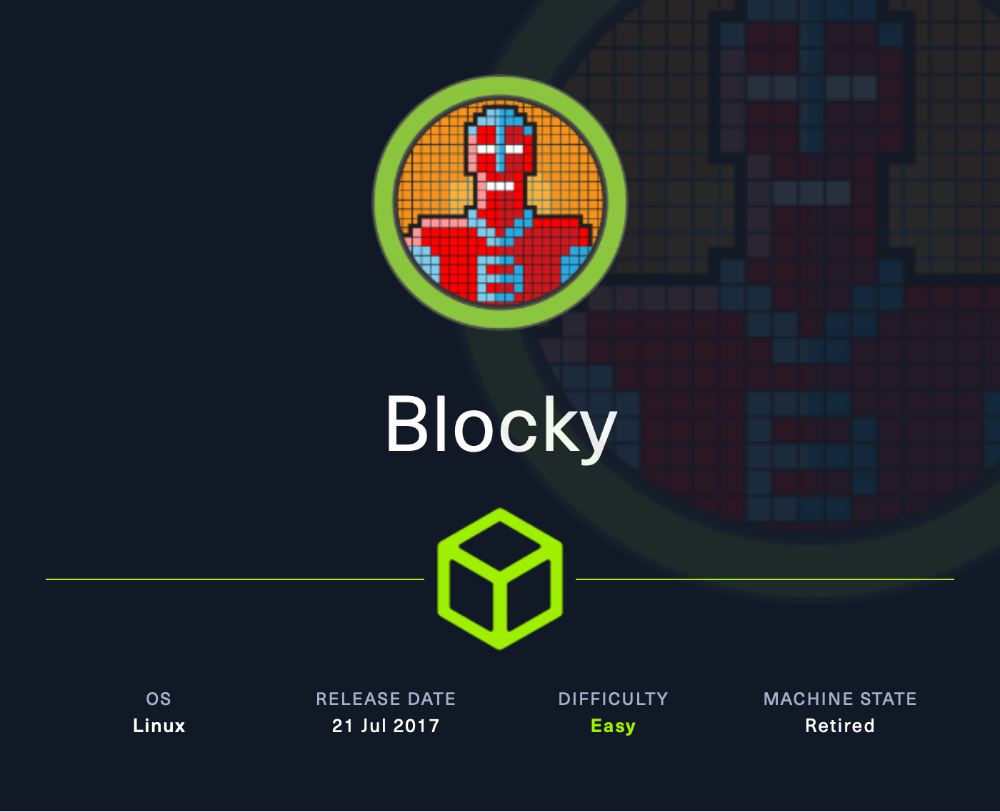

+++
title = "HTB - Blocky"
date = 2024-09-16
+++

</img>

Blocky is an easy machine that allows attackers to leverage their understandings of web-enumeration and simple privilege escalation to obtain a root shell on a system. Let's get to it.
### Reconnaissance
```
└─# nmap -sV -sC --open -p- 10.10.10.37
Starting Nmap 7.94SVN ( https://nmap.org ) at 2024-09-07 12:40 EDT
Nmap scan report for 10.10.10.37
Host is up (0.12s latency).
Not shown: 65530 filtered tcp ports (no-response), 1 closed tcp port (reset)
Some closed ports may be reported as filtered due to --defeat-rst-ratelimit
PORT      STATE SERVICE   VERSION
21/tcp    open  ftp       ProFTPD 1.3.5a
22/tcp    open  ssh       OpenSSH 7.2p2 Ubuntu 4ubuntu2.2 (Ubuntu Linux; protocol 2.0)
| ssh-hostkey: 
|   2048 d6:2b:99:b4:d5:e7:53:ce:2b:fc:b5:d7:9d:79:fb:a2 (RSA)
|   256 5d:7f:38:95:70:c9:be:ac:67:a0:1e:86:e7:97:84:03 (ECDSA)
|_  256 09:d5:c2:04:95:1a:90:ef:87:56:25:97:df:83:70:67 (ED25519)
80/tcp    open  http      Apache httpd 2.4.18
|_http-title: Did not follow redirect to http://blocky.htb
|_http-server-header: Apache/2.4.18 (Ubuntu)
25565/tcp open  minecraft Minecraft 1.11.2 (Protocol: 127, Message: A Minecraft Server, Users: 0/20)
Service Info: Host: 127.0.1.1; OSs: Unix, Linux; CPE: cpe:/o:linux:linux_kernel

Service detection performed. Please report any incorrect results at https://nmap.org/submit/ .
Nmap done: 1 IP address (1 host up) scanned in 164.28 seconds

```

Our `nmap` scan shows 4 vectors. FTP is usually the first thing to check, simply to dictate whether or not we have access to anonymous login. SSH is something that usually points towards a late-stage vector, but rarely is it the first step in the door. Port 80 is like a box of chocolates, and the Minecraft server running on port 25565 is interesting, so we'll mark it and come back if nothing shakes.
### Enumeration

</img>

The website takes us to a website that is under construction. We'll need to denote the name `notch`, as usernames are often the first step towards gaining access. Parsing through the initial page, there isn't much for us to look at. A search box is of slight interest, but a `gobuster` scan would flesh out our understanding a bit more.

It's important to note here the importance of wordlists. The `2.3 Medium` wordlists should be good enough for any HTB or OSCP engagement we encounter, as the odds are very low that the we are dealing with a directory or a subdomain out of scope by that much. It's crucial to let the tool run it's course though... Sometimes valuable directories pop-up at the very last second during the scan.

</img>

We get a few solid hits here, and through a bit of searching, we can come across two `JAR` files from the backend. This is a lesson in being able to reverse engineer plugins and code, which means that your eye as a developer needs to be on point. 
In doing so, we can find credentials stored in plaintext within the files.

 </img>
### Initial Access & Privilege Escalation

We've got the `notch` username from earlier and a mention of `root` as well. This lines up well with what I mentioned before about SSH being a later-stage opportunity to capitalize on credentials. After a few attempts, we're able to get a shell with `ssh notch@<IP> -p 8YsqfCTnvxAUeduzjNSXe22 `

</img>

From here, my initial process is to always try and see what I'm working with using `sudo -l`, but we're unable on this box. Consequentially, I tried to grab `root` with `sudo su` and it worked! We can grab both flags.

`USER:cf3f9133b48d9782445b0c632d9ae71f`

`ROOT:0c7bf2427da75d3c55da728115a7e8c6`

#easy #linux #manual 